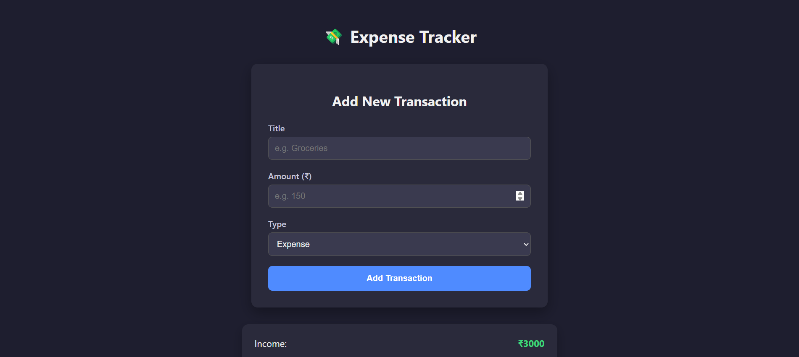

# 💸 Expense Tracker App (React + Vite)

This is a simple and responsive **Expense Tracker App** built with **React** and **Vite**. It allows users to:
- Add income and expense transactions
- View transaction history
- See a summary of income, expenses, and balance
- Fully styled with a modern **dark theme**

---

## 🖼️ Preview

| Add Transaction | Summary & List |
|-----------------|----------------|
|  |  |

> 🔍 You can add more images in the `screenshots/` folder and update the paths here.

---

## 🚀 Features

- ✅ Add expense/income with title, amount, and type
- 🎯 View transaction list with colored indicators
- 💡 Real-time total income, expense, and balance summary
- 🌙 Modern **dark theme**
- ⚛️ Built using **React + Vite**

---

## 🛠️ Tech Stack

- [React](https://reactjs.org/)
- [Vite](https://vitejs.dev/)
- [CSS](https://developer.mozilla.org/en-US/docs/Web/CSS)

---

## 📦 Installation & Setup

```bash
# Clone the repo
git clone https://github.com/Bhuvneshjangid/expensetracker.git
cd expensetracker

# Install dependencies
npm install

# Start the development server
npm run dev
